# Dynamic Latest Version Testing

**Feature**: Automatic testing against the absolute latest Home Assistant release  
**Implementation Date**: October 25, 2025  
**Status**: ✅ Active

---

## Overview

The nightly compatibility workflow now **automatically detects and tests against the latest Home Assistant version** without requiring any manual updates to the repository.

### Key Benefits

- 🔥 **Always Up-to-Date**: Tests the latest HA version as soon as it's released
- 🚀 **Zero Maintenance**: No manual workflow updates needed when new HA versions are released
- 🎯 **Dual-Source Detection**: Checks both PyPI and GitHub for the absolute latest
- 📊 **Comprehensive Coverage**: Tests both fixed versions AND the dynamic latest

---

## How It Works

### 1. Dual-Source Version Detection

The workflow checks **two sources** to ensure it catches the absolute latest:

```yaml
# Check PyPI (usually most current)
PYPI_VERSION=$(curl -s https://pypi.org/pypi/homeassistant/json | jq -r '.info.version')

# Check GitHub Releases (official releases)
GITHUB_VERSION=$(curl -s https://api.github.com/repos/home-assistant/core/releases/latest | jq -r '.tag_name')

# Use the most current one
LATEST_VERSION=${PYPI_VERSION:-$GITHUB_VERSION}
```

**Why two sources?**
- PyPI usually gets updates first (within hours of release)
- GitHub Releases is the official source but may lag slightly
- Using both ensures we never miss a version

### 2. Dynamic Matrix Testing

The smoke test now includes a **dynamic entry** that always uses the latest:

```yaml
matrix:
  version:
    - "2025.4.0"        # Fixed versions for stability
    - "2025.6.0"
    - "2025.8.0"
    - "2025.9.0"
    - "2025.10.0"
    - "${{ needs.get-latest-version.outputs.latest_version }}"  # 🔥 Dynamic!
```

This means every night, the workflow tests:
- 5 fixed historical versions (for regression testing)
- 1 dynamic "whatever is latest right now" version

### 3. Full Test Suite

The latest version gets tested in **two ways**:

#### A. Comprehensive Unit Tests
- Full pytest suite
- All test files
- With coverage reporting
- Result stored and reported

#### B. Quick Smoke Test
- Import validation
- Module loading
- Basic compatibility check
- Part of multi-version matrix

---

## What Gets Tested Nightly

### Test Coverage

| Test Type | Fixed Versions | Dynamic Latest | Total |
|-----------|----------------|----------------|-------|
| **Unit Tests** | - | ✅ (from PyPI/GitHub) | 1 |
| **Smoke Tests** | 2025.4, 2025.6, 2025.8, 2025.9, 2025.10 | ✅ (dynamic) | 6 |
| **Dev Branch** | - | ✅ (git dev) | 1 |
| **Total** | 5 fixed | 3 dynamic | **8 versions** |

### Version Detection Flow

```mermaid
graph TD
    A[Nightly Trigger 2 AM UTC] --> B[Fetch from PyPI]
    A --> C[Fetch from GitHub]
    B --> D{Version Available?}
    C --> D
    D -->|Yes| E[Use Latest Version]
    D -->|Fallback| F[Use GitHub Version]
    E --> G[Run Full Test Suite]
    F --> G
    G --> H[Run Smoke Tests]
    H --> I[Generate Report]
    I --> J{Tests Pass?}
    J -->|Yes| K[Success! 🎉]
    J -->|No| L[Create/Update Issue 🚨]
```



---

## Example Scenarios

### Scenario 1: New HA Release (2025.11.0)

**Timeline:**
- **Wednesday, Nov 6, 2:00 AM**: Home Assistant 2025.11.0 is released
- **Wednesday, Nov 6, 3:00 AM**: PyPI updates (usually within 1 hour)
- **Thursday, Nov 7, 2:00 AM**: Our nightly workflow runs
  - ✅ Detects 2025.11.0 from PyPI
  - ✅ Installs and tests automatically
  - ✅ Report shows: "Tested with latest: 2025.11.0"
  - ✅ No repo changes needed!

**Result**: You know within 24 hours if your integration works with the new version!

### Scenario 2: Patch Release (2025.10.3)

**Timeline:**
- **Monday**: HA releases 2025.10.3 (patch fix)
- **Tuesday, 2:00 AM**: Nightly workflow runs
  - ✅ Detects 2025.10.3
  - ✅ Tests automatically
  - ✅ Separate from fixed 2025.10.0 test

**Result**: You test both the stable reference version AND the latest patch!

### Scenario 3: Breaking Change Detection

**Timeline:**
- **Day 1**: HA 2025.11.0 released with breaking API change
- **Day 2, 2 AM**: Nightly detects and tests
  - ❌ Tests fail with 2025.11.0
  - 🔔 GitHub issue created automatically
  - 📝 Issue includes version info and error logs

**Result**: You know about the breaking change immediately, before users report it!

---

## Reports and Notifications

### Nightly Report Format

```markdown
# 🔍 Nightly Compatibility Check Report

**Date**: 2025-11-07 02:15:00 UTC

## Versions Tested

- **Dynamic Latest**: 2025.11.0 🔥
- **Fixed Versions**: 2025.4.0, 2025.6.0, 2025.8.0, 2025.9.0, 2025.10.0
- **Dev Branch**: Latest development version

## Test Results

✅ **Latest Stable HA** (2025.11.0): Tests Passed
✅ **HA Dev Branch**: Tests Passed
✅ **Multi-Version Smoke Tests**: All Passed (including latest 2025.11.0)

### Detailed Smoke Test Results

✅ HA 2025.4.0: PASSED
✅ HA 2025.6.0: PASSED
✅ HA 2025.8.0: PASSED
✅ HA 2025.9.0: PASSED
✅ HA 2025.10.0: PASSED
✅ HA 2025.11.0: PASSED  # 🔥 Dynamic latest!

## Recommendations

- ✨ Integration appears compatible with all tested HA versions
- 🎉 Including the absolute latest release (2025.11.0)
- 📊 Continue monitoring for changes
```

### Automatic Issue Creation

If the latest version fails, an issue is automatically created:

**Issue Title**: 🚨 Nightly Compatibility Check Failed

**Issue Body**:
```markdown
# 🔍 Nightly Compatibility Check Report

**Date**: 2025-11-07 02:15:00 UTC

## Test Results

❌ **Latest Stable HA** (2025.11.0): Tests Failed
⚠️ **HA Dev Branch**: Tests Failed

## Recommendations

- 🚨 **Critical**: Integration failing with latest stable HA version!
- 🔧 Immediate investigation recommended
- 📝 Check release notes for breaking changes

[View workflow run](link-to-run)
```

**Labels**: `compatibility`, `automated`, `needs-investigation`

---

## Benefits Over Static Versions

### Before (Static Versions Only)

```yaml
# Old approach - requires manual updates
matrix:
  version:
    - "2025.10.0"  # Need to update this manually!
```

**Problems**:
- ❌ Miss new releases until manually updated
- ❌ Delay in detecting compatibility issues
- ❌ Maintenance burden on every HA release
- ❌ Risk of forgetting to update

### After (Dynamic + Static)

```yaml
# New approach - automatic!
matrix:
  version:
    - "2025.10.0"  # Stable reference
    - "${{ needs.get-latest-version.outputs.latest_version }}"  # Always latest!
```

**Advantages**:
- ✅ **Immediate detection** of new version compatibility
- ✅ **Zero maintenance** for version updates
- ✅ **Proactive alerts** within 24 hours
- ✅ **Best of both**: fixed references + dynamic latest

---

## Version Information in Reports

Each test run now includes detailed version information:

```yaml
Test Results Artifact:
├── Version Tested: 2025.11.0
├── GitHub Latest: 2025.11.0
├── PyPI Latest: 2025.11.0
└── Test Status: PASSED ✅
```

This helps you understand:
- Which exact version was tested
- Whether PyPI and GitHub are in sync
- When a new version appears on one source but not the other

---

## Workflow Schedule

**Runs**: Every night at 2:00 AM UTC

**Why nightly?**
- Home Assistant releases on first Wednesday of each month
- Nightly checks catch new releases within 24 hours
- Also catches patch releases (e.g., 2025.10.1, 2025.10.2)
- Doesn't spam with every push/PR

**Can also run manually:**
```bash
# Via GitHub UI: Actions → Nightly Compatibility Check → Run workflow
```

---

## Maintenance

### What You Need to Do: NOTHING! 🎉

The dynamic version detection is **fully automated**:
- ✅ No workflow updates needed
- ✅ No version bumps required
- ✅ No manual intervention

### What the Workflow Does Automatically:

1. **Every night at 2 AM UTC:**
   - Fetches latest version from PyPI
   - Fetches latest version from GitHub
   - Picks the most current one
   - Installs and tests it
   - Reports results

2. **On test failure:**
   - Creates GitHub issue automatically
   - Includes version details
   - Links to workflow run
   - Tags with appropriate labels

3. **On test success after previous failure:**
   - Comments on the open issue
   - Suggests closing if all stable

### Optional: Quarterly Review

While the workflow is automatic, you might want to:

**Every 3 months:**
- Review fixed version list (currently 2025.4 through 2025.10)
- Consider removing very old versions (e.g., drop 2025.4 after 6 months)
- Keep 4-6 months of history for regression testing

**Not required for dynamic latest** - that part is truly zero maintenance!

---

## Technical Details

### Jobs in Workflow

1. **`test-latest-stable`**
   - Fetches latest from both PyPI and GitHub
   - Runs full pytest suite
   - Uploads detailed results

2. **`get-latest-version`**
   - Shared job that fetches latest once
   - Output used by other jobs
   - Ensures consistency across tests

3. **`smoke-test-multiple-versions`**
   - Tests 5 fixed + 1 dynamic version
   - Quick import and module loading checks
   - Matrix runs in parallel

4. **`test-dev-branch`**
   - Tests against HA development branch
   - Preview of upcoming features
   - Optional (can be disabled)

5. **`report`**
   - Aggregates all results
   - Generates comprehensive report
   - Creates/updates issues as needed

### Error Handling

The workflow is designed to be resilient:

```yaml
continue-on-error: true  # Don't fail entire workflow if one version fails
```

This means:
- One version failing doesn't stop other tests
- You get complete picture of compatibility
- Reports show which specific versions pass/fail

### Artifact Storage

Results are stored for 30 days:
- Latest stable results
- Dev branch results
- Individual smoke test results
- Compatibility reports

---

## Comparison: Before vs After

### Before This Change

**Test Coverage:**
```
Fixed Versions: 2025.4.0, 2025.6.0, 2025.8.0, 2025.9.0, 2025.10.0
Total: 5 versions
Latest HA: 2025.10.2 ❌ NOT TESTED (requires manual update)
```

**When 2025.11.0 releases:**
- ❌ Not tested until workflow manually updated
- ❌ Delay of days or weeks
- ❌ Users might report issues first

### After This Change

**Test Coverage:**
```
Fixed Versions: 2025.4.0, 2025.6.0, 2025.8.0, 2025.9.0, 2025.10.0
Dynamic Latest: 2025.10.2 ✅ TESTED AUTOMATICALLY
Total: 6 versions (5 fixed + 1 dynamic)
```

**When 2025.11.0 releases:**
- ✅ Tested within 24 hours automatically
- ✅ Issue created if incompatible
- ✅ You know before users do

---

## Example Commands

### View Latest Detected Version

```bash
# Check what version the workflow would test
curl -s https://pypi.org/pypi/homeassistant/json | jq -r '.info.version'

# Example output: 2025.10.2
```

### Manual Trigger with Latest

```bash
# Via GitHub CLI
gh workflow run nightly-compatibility.yaml

# The workflow will automatically fetch and test the latest version
```

### Check Test Results

```bash
# Download latest report
gh run download <run-id> -n compatibility-report-<number>

# View the report
cat report.md
```

---

## FAQ

**Q: What if PyPI is down?**  
A: Workflow falls back to GitHub API. Both sources would need to fail.

**Q: What if a version is only on one source?**  
A: We take whatever is available. PyPI is preferred if both exist.

**Q: Does this increase CI costs?**  
A: Minimal - runs once per day, not on every push/PR.

**Q: Can I disable the dynamic latest?**  
A: Yes, remove the dynamic entry from the matrix in the workflow.

**Q: Will this work for beta versions?**  
A: By default, it uses stable releases. Dev branch is tested separately.

**Q: What if I want to test specific beta version?**  
A: You can manually trigger the workflow and specify version in inputs (enhancement possible).

---

## Related Documentation

- [CI/CD Testing Guide](docs/CI_CD_TESTING.md) - Complete testing documentation
- [Nightly Compatibility Workflow](.github/workflows/nightly-compatibility.yaml) - The actual workflow file

---

## Success Metrics

After implementing this feature:

- ✅ **Zero manual version updates** needed for nightly tests
- ✅ **24-hour detection** of new HA releases
- ✅ **Automatic issue creation** on compatibility failures
- ✅ **6 versions tested** every night (up from 5)
- ✅ **Future-proof** - works with HA 2025, 2026, 2027...

---

**Status**: ✅ Active and Running

The nightly workflow now automatically tests against the latest Home Assistant version without any manual intervention required!

