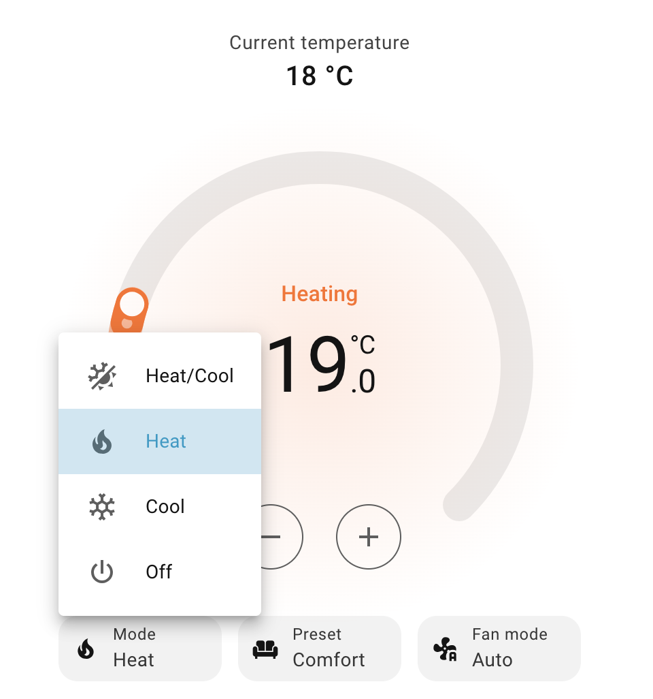

# Climate Control Guide

Learn how to control your Hitachi heat pump zones through Home Assistant climate entities.

## Overview

Each zone or thermostat in your Hitachi system appears as a **climate entity** in Home Assistant. These entities provide full control over:

- 🌡️ **Temperature** - Set target temperature
- 🔥 **HVAC Mode** - Heat, Cool, Auto, or Off
- 💚 **Preset Mode** - Comfort or Eco
- 🔇 **Fan Mode** - Silent mode or fan speed (system dependent)
- 📊 **Status** - Current temperature, operation status, alarms

---

## Entity Naming

Climate entities are named based on your system configuration:

**Format**: `climate.{device_name}_{zone_name}`

**Examples**:
- `climate.remote_living_room`
- `climate.remote_first_floor`
- `climate.remote_zone_1`

The name combines:
- **Device name**: From CSNet Manager (usually "Remote")
- **Zone name**: Your configured zone/room name

---

## Basic Controls

### Setting Target Temperature

**Via UI**:
1. Open the climate entity card
2. Use the **+** and **-** buttons
3. Or drag the temperature slider

**Via Service Call**:
```yaml
service: climate.set_temperature
target:
  entity_id: climate.remote_living_room
data:
  temperature: 22
```

**Via Automation**:
```yaml
automation:
  - alias: "Set Morning Temperature"
    trigger:
      - platform: time
        at: "07:00:00"
    action:
      - service: climate.set_temperature
        target:
          entity_id: climate.remote_living_room
        data:
          temperature: 21
```

**Temperature Range**:
- **Heating**: Typically 8°C to 55°C
- **Cooling**: Typically 18°C to 30°C
- **DHW**: Typically 30°C to 55°C
- Exact ranges vary by system configuration

### Changing HVAC Mode

Available modes depend on your system:

| Mode | Description | When to Use |
|------|-------------|-------------|
| **Off** | System off, no heating or cooling | When you don't need climate control |
| **Heat** | Heating mode only | Cold weather, winter |
| **Cool** | Cooling mode only | Hot weather, summer (if supported) |
| **Heat/Cool (Auto)** | Automatic heating/cooling | Transitional seasons, maintains comfort automatically |

**Via UI**:
1. Click on climate entity
2. Click the mode button (shows current mode)
3. Select desired mode



**Via Service Call**:
```yaml
service: climate.set_hvac_mode
target:
  entity_id: climate.remote_living_room
data:
  hvac_mode: heat
```

**Via Automation**:
```yaml
automation:
  - alias: "Winter Mode"
    trigger:
      - platform: numeric_state
        entity_id: sensor.system_controller_outdoor_temperature
        below: 15
    action:
      - service: climate.set_hvac_mode
        target:
          entity_id: climate.remote_living_room
        data:
          hvac_mode: heat
```

### Turning On/Off

**Quick On/Off**:
```yaml
# Turn on
service: climate.turn_on
target:
  entity_id: climate.remote_living_room

# Turn off
service: climate.turn_off
target:
  entity_id: climate.remote_living_room
```

**Note**: `turn_on` will restore the last active mode (Heat, Cool, or Auto).

### Using Preset Modes

Preset modes adjust the target temperature for energy savings:

| Preset | Description | Temperature Adjustment |
|--------|-------------|----------------------|
| **Comfort** | Normal comfort temperature | Full target temperature |
| **Eco** | Energy-saving mode | Reduced temperature (~2-3°C lower in heating) |

**Via UI**:
1. Open climate entity
2. Click **Preset** button
3. Select **Comfort** or **Eco**

**Via Service Call**:
```yaml
service: climate.set_preset_mode
target:
  entity_id: climate.remote_living_room
data:
  preset_mode: eco
```

**Via Automation** (Eco mode at night):
```yaml
automation:
  - alias: "Night Eco Mode"
    trigger:
      - platform: time
        at: "23:00:00"
    action:
      - service: climate.set_preset_mode
        target:
          entity_id: climate.remote_living_room
        data:
          preset_mode: eco
          
  - alias: "Morning Comfort Mode"
    trigger:
      - platform: time
        at: "06:30:00"
    action:
      - service: climate.set_preset_mode
        target:
          entity_id: climate.remote_living_room
        data:
          preset_mode: comfort
```

---

## Advanced Controls

### Fan Mode Control

Fan mode behavior depends on your system type:

#### Non-Fan Coil Systems (Standard)

**Silent Mode** - Reduces outdoor unit noise:
- **Auto** = Normal operation
- **On** = Silent mode enabled

```yaml
service: climate.set_fan_mode
target:
  entity_id: climate.remote_living_room
data:
  fan_mode: "on"  # Silent mode
```

#### Fan Coil Systems

**Fan Speed Control**:
- **Off** = Fan off
- **Low** = Low speed
- **Medium** = Medium speed
- **Auto** = Automatic speed

```yaml
service: climate.set_fan_mode
target:
  entity_id: climate.remote_living_room
data:
  fan_mode: medium
```

**Checking System Type**:

Look at the climate entity attributes:
```yaml
is_fan_coil_compatible: true  # or false
fan_modes: ["off", "low", "medium", "auto"]  # Fan coil
fan_modes: ["auto", "on"]  # Standard (silent mode)
```

### Fixed Water Temperature Control (Water Circuits Only)

For **water circuits** (C1 Water and C2 Water), you can control the fixed water supply temperature when your system is configured in **Fixed Temperature mode** (OTC type = FIX).

#### Understanding OTC (Outdoor Temperature Compensation)

Your Hitachi system can operate in different **OTC (Outdoor Temperature Compensation)** modes:

- **Fixed Mode (FIX)**: Water temperature is set to a fixed value you control
- **Gradient/Points Mode**: Water temperature is automatically calculated based on outdoor temperature

**Important**: Fixed water temperature control is **only available when OTC type is set to FIX**. If your system uses Gradient or Points mode, the water temperature is automatically calculated and cannot be manually set.

#### Checking Your OTC Mode

Check your climate entity attributes to see your current OTC mode:

```yaml
# For C1 circuit
otc_heating_type: 3  # 3 = Fixed mode
otc_heating_type_name: "Fixed"

# For C2 circuit
otc_heating_type_c2: 3
otc_heating_type_name_c2: "Fixed"
```

**OTC Type Values**:
- **Heating**: None (0), Points (1), Gradient (2), **Fixed (3)**
- **Cooling**: None (0), Points (1), **Fixed (2)**

#### Number Entities for Fixed Water Temperature

When your system is in **Fixed mode (OTC = FIX)**, number entities automatically appear for controlling the fixed water temperature:

**Entity Names**:
- `number.{zone_name}_fixed_water_temperature_heating_c1` - C1 heating mode
- `number.{zone_name}_fixed_water_temperature_cooling_c1` - C1 cooling mode
- `number.{zone_name}_fixed_water_temperature_heating_c2` - C2 heating mode
- `number.{zone_name}_fixed_water_temperature_cooling_c2` - C2 cooling mode

**Examples**:
- `number.salon_fixed_water_temperature_heating_c1`
- `number.bibliotheque_fixed_water_temperature_cooling_c2`

**Note**: These entities are **circuit-level** settings that affect both air zones (1,2) and water zones (5,6) of the same circuit. The fixed water temperature controls the water supply temperature for the entire circuit.

#### Using Fixed Water Temperature Control

**Via UI**:
1. Open the number entity (e.g., `number.salon_fixed_water_temperature_heating_c1`)
2. Adjust the temperature value
3. The value is saved automatically

**Via Service Call**:
```yaml
service: number.set_value
target:
  entity_id: number.salon_fixed_water_temperature_heating_c1
data:
  value: 45  # Set fixed water temperature to 45°C
```

**Via Automation**:
```yaml
automation:
  - alias: "Set Fixed Water Temperature for Winter"
    trigger:
      - platform: time
        at: "06:00:00"
    action:
      - service: number.set_value
        target:
          entity_id: number.salon_fixed_water_temperature_heating_c1
        data:
          value: 50  # Higher temperature for cold days
          
  - alias: "Set Fixed Water Temperature for Spring"
    trigger:
      - platform: time
        at: "20:00:00"
    condition:
      - condition: numeric_state
        entity_id: sensor.system_controller_outdoor_temperature
        above: 15
    action:
      - service: number.set_value
        target:
          entity_id: number.salon_fixed_water_temperature_heating_c1
        data:
          value: 40  # Lower temperature for milder weather
```

#### Climate Entity Behavior for Water Circuits

For **water zones** (zone_id 5 = C1 Water, zone_id 6 = C2 Water):

- **When OTC type is FIX**: The climate entity's `target_temperature` shows the fixed water temperature and can be edited
- **When OTC type is NOT FIX** (Gradient/Points): The climate entity's `target_temperature` returns `None` (unavailable) since the temperature is automatically calculated

**For air zones** (zone_id 1 = C1 Air, zone_id 2 = C2 Air):
- The climate entity's `target_temperature` always shows the **room temperature** (`settingTempRoomZ1/Z2`) and is always editable
- Fixed water temperature is controlled via the **separate number entity** (when OTC is FIX)
- Room temperature and fixed water temperature are **independent settings**

#### Temperature Range

Fixed water temperature typically ranges from:
- **Heating**: 20°C to 80°C (varies by system)
- **Cooling**: 10°C to 30°C (varies by system)

Check the number entity's `min` and `max` attributes for your system's exact range.

#### Why Don't I See the Number Entity?

If you don't see the fixed water temperature number entity, it's because:

1. **Your OTC type is NOT FIX** - The entity only appears when OTC type is FIX
2. **System not in Fixed mode** - Check your climate entity attributes to see your current OTC type
3. **Entity not created yet** - The entity appears automatically when conditions are met

**To enable fixed temperature control**:
- Change your OTC type to FIX in the CSNet Manager app or website
- The number entity will appear automatically after the next integration update

#### Example: Seasonal Temperature Adjustment

```yaml
automation:
  - alias: "Winter Fixed Water Temperature"
    trigger:
      - platform: numeric_state
        entity_id: sensor.system_controller_outdoor_temperature
        below: 5
        for: "01:00:00"
    action:
      - service: number.set_value
        target:
          entity_id: number.salon_fixed_water_temperature_heating_c1
        data:
          value: 55  # Higher temperature for cold weather
          
  - alias: "Spring Fixed Water Temperature"
    trigger:
      - platform: numeric_state
        entity_id: sensor.system_controller_outdoor_temperature
        above: 15
        for: "01:00:00"
    action:
      - service: number.set_value
        target:
          entity_id: number.salon_fixed_water_temperature_heating_c1
        data:
          value: 40  # Lower temperature for milder weather
```

#### Troubleshooting

**Entity Not Available**:
- Check that OTC type is FIX in climate entity attributes
- Verify the number entity exists in Home Assistant
- Check integration logs for errors

**Temperature Not Changing**:
- Ensure OTC type is FIX (not Gradient/Points)
- Check that the number entity is available
- Verify the value is within the allowed range (check min/max)

**Want to Use Fixed Mode**:
- Change OTC type to FIX in CSNet Manager app/website
- The number entity will appear automatically
- You can then set fixed water temperature via Home Assistant

---

## Reading Climate State

### Current Temperature

The actual measured temperature in the zone:

```yaml
{{ state_attr('climate.remote_living_room', 'current_temperature') }}
```

### Target Temperature

The desired temperature setpoint:

```yaml
{{ state_attr('climate.remote_living_room', 'temperature') }}
```

### HVAC Action

What the system is currently doing:

- **heating** - Actively heating
- **cooling** - Actively cooling
- **idle** - On but not actively heating/cooling
- **off** - System is off

```yaml
{{ state_attr('climate.remote_living_room', 'hvac_action') }}
```

**Example Automation** (based on action):
```yaml
automation:
  - alias: "Alert When Heating"
    trigger:
      - platform: state
        entity_id: climate.remote_living_room
        attribute: hvac_action
        to: "heating"
    action:
      - service: notify.mobile_app
        data:
          message: "Heating started in living room"
```

---

## Extended Attributes

Climate entities provide additional information as attributes:

### Operation Status

Detailed operation status from the heat pump:

```yaml
operation_status: 6  # Numeric code
operation_status_text: "Heating Thermostat On"  # Human-readable
```

**Status Codes**:
- `0` - Off
- `1` - Cooling Demand Off
- `2` - Cooling Thermostat Off
- `3` - Cooling Thermostat On
- `4` - Heating Demand Off
- `5` - Heating Thermostat Off
- `6` - Heating Thermostat On
- `7` - DHW Off
- `8` - DHW On
- `11` - Alarm

### Real Mode

The actual operating mode (may differ from set mode in Auto):

```yaml
real_mode: 1  # 0=Cool, 1=Heat, 2=Auto
```

### Circuit Demand

Shows which circuits are calling for heat/cool:

```yaml
c1_demand: true   # C1 circuit requesting
c2_demand: false  # C2 circuit not requesting
```

### Boost Status

Indicates if boost mode is active:

```yaml
doingBoost: false
```

### Alarm Information

Current alarm status:

```yaml
alarm_code: 0  # 0 = No alarm, >0 = Alarm code
```

### Silent Mode Status

Current silent mode setting (non-fan coil):

```yaml
silent_mode: 0  # 0=Off, 1=On
```

### Fan Speeds (Fan Coil Only)

Current fan speeds for each circuit:

```yaml
fan1_speed: 3  # C1 fan speed (0-3)
fan2_speed: 2  # C2 fan speed (0-3)
fan1_control_available: true
fan2_control_available: true
```

### OTC Information

Outdoor Temperature Compensation settings:

```yaml
otc_heating_type: 1
otc_heating_type_name: "Points"
otc_cooling_type: 0
otc_cooling_type_name: "None"
```

**OTC Types**:
- **Heating**: None (0), Points (1), Gradient (2), Fixed (3)
- **Cooling**: None (0), Points (1), Fixed (2)

---

## Complete Attributes Example

```yaml
climate.remote_living_room:
  state: heat
  attributes:
    current_temperature: 20.5
    temperature: 22.0
    target_temp_high: null
    target_temp_low: null
    hvac_modes:
      - "off"
      - heat
      - cool
      - heat_cool
    min_temp: 8
    max_temp: 55
    preset_modes:
      - comfort
      - eco
    preset_mode: comfort
    hvac_action: heating
    fan_modes:
      - auto
      - "on"
    fan_mode: auto
    real_mode: 1
    operation_status: 6
    operation_status_text: "Heating Thermostat On"
    timer_running: false
    alarm_code: 0
    c1_demand: true
    c2_demand: false
    doingBoost: false
    silent_mode: 0
    is_fan_coil_compatible: false
```

---

## Lovelace UI Examples

### Basic Thermostat Card

```yaml
type: thermostat
entity: climate.remote_living_room
```


### Detailed Climate Card

```yaml
type: vertical-stack
cards:
  - type: thermostat
    entity: climate.remote_living_room
    
  - type: entities
    entities:
      - entity: sensor.remote_living_room_current_temperature
        name: Current Temperature
      - entity: sensor.remote_living_room_target_temperature
        name: Target Temperature
      - entity: climate.remote_living_room
        type: attribute
        attribute: hvac_action
        name: Action
      - entity: climate.remote_living_room
        type: attribute
        attribute: operation_status_text
        name: Status
```

### Custom Button Card (with custom:button-card)

```yaml
type: custom:button-card
entity: climate.remote_living_room
name: Living Room
show_state: true
show_icon: true
tap_action:
  action: more-info
state_display: |
  [[[ return entity.attributes.current_temperature + '°C → ' + 
      entity.attributes.temperature + '°C' ]]]
styles:
  card:
    - height: 100px
  state:
    - font-size: 14px
```

### Climate Control Panel

```yaml
type: vertical-stack
cards:
  - type: markdown
    content: "## Living Room Climate"
    
  - type: horizontal-stack
    cards:
      - type: button
        name: "Comfort"
        icon: mdi:home-thermometer
        tap_action:
          action: call-service
          service: climate.set_preset_mode
          service_data:
            entity_id: climate.remote_living_room
            preset_mode: comfort
            
      - type: button
        name: "Eco"
        icon: mdi:leaf
        tap_action:
          action: call-service
          service: climate.set_preset_mode
          service_data:
            entity_id: climate.remote_living_room
            preset_mode: eco
            
      - type: button
        name: "Off"
        icon: mdi:power
        tap_action:
          action: call-service
          service: climate.turn_off
          service_data:
            entity_id: climate.remote_living_room
  
  - type: thermostat
    entity: climate.remote_living_room
```

---

## Common Automation Examples

### Temperature Schedule

```yaml
automation:
  - alias: "Living Room Temperature Schedule"
    trigger:
      - platform: time
        at: "06:00:00"
        id: morning
      - platform: time
        at: "09:00:00"
        id: day
      - platform: time
        at: "17:00:00"
        id: evening
      - platform: time
        at: "23:00:00"
        id: night
    action:
      - choose:
          - conditions:
              - condition: trigger
                id: morning
            sequence:
              - service: climate.set_temperature
                target:
                  entity_id: climate.remote_living_room
                data:
                  temperature: 21
              - service: climate.set_preset_mode
                target:
                  entity_id: climate.remote_living_room
                data:
                  preset_mode: comfort
                  
          - conditions:
              - condition: trigger
                id: day
            sequence:
              - service: climate.set_temperature
                target:
                  entity_id: climate.remote_living_room
                data:
                  temperature: 20
              - service: climate.set_preset_mode
                target:
                  entity_id: climate.remote_living_room
                data:
                  preset_mode: eco
                  
          - conditions:
              - condition: trigger
                id: evening
            sequence:
              - service: climate.set_temperature
                target:
                  entity_id: climate.remote_living_room
                data:
                  temperature: 22
              - service: climate.set_preset_mode
                target:
                  entity_id: climate.remote_living_room
                data:
                  preset_mode: comfort
                  
          - conditions:
              - condition: trigger
                id: night
            sequence:
              - service: climate.set_temperature
                target:
                  entity_id: climate.remote_living_room
                data:
                  temperature: 18
              - service: climate.set_preset_mode
                target:
                  entity_id: climate.remote_living_room
                data:
                  preset_mode: eco
```

### Away Mode

```yaml
automation:
  - alias: "Away Mode - Turn Off Heating"
    trigger:
      - platform: state
        entity_id: person.home_owner
        to: "not_home"
        for: "01:00:00"
    action:
      - service: climate.turn_off
        target:
          entity_id: all
          
  - alias: "Return Home - Resume Heating"
    trigger:
      - platform: state
        entity_id: person.home_owner
        to: "home"
    action:
      - service: climate.turn_on
        target:
          entity_id: all
      - service: climate.set_temperature
        target:
          entity_id: climate.remote_living_room
        data:
          temperature: 21
```

### Weather-Based Control

```yaml
automation:
  - alias: "Switch to Cooling on Hot Days"
    trigger:
      - platform: numeric_state
        entity_id: weather.home
        attribute: temperature
        above: 25
    condition:
      - condition: state
        entity_id: climate.remote_living_room
        state: heat
    action:
      - service: climate.set_hvac_mode
        target:
          entity_id: climate.remote_living_room
        data:
          hvac_mode: cool
      - service: climate.set_temperature
        target:
          entity_id: climate.remote_living_room
        data:
          temperature: 24
```

### Energy Saving

```yaml
automation:
  - alias: "Eco Mode During Peak Hours"
    trigger:
      - platform: time
        at: "17:00:00"
    condition:
      - condition: time
        weekday:
          - mon
          - tue
          - wed
          - thu
          - fri
    action:
      - service: climate.set_preset_mode
        target:
          entity_id: all
        data:
          preset_mode: eco
          
  - alias: "Comfort Mode After Peak Hours"
    trigger:
      - platform: time
        at: "21:00:00"
    action:
      - service: climate.set_preset_mode
        target:
          entity_id: all
        data:
          preset_mode: comfort
```

---

## Troubleshooting

### Temperature Not Changing

**Symptoms**: Set temperature but nothing happens

**Possible Causes**:
1. **System is off** - Check HVAC mode
2. **Temperature already reached** - Check current vs target
3. **Eco mode active** - May use different setpoint
4. **Manual override** - Someone changed it at the physical thermostat

**Solutions**:
- Ensure HVAC mode is Heat or Cool (not Off)
- Check operation_status attribute
- Try toggling between Comfort and Eco
- Check CSNet Manager app for manual overrides

### Controls Not Responding

**Symptoms**: Commands sent but no effect

**Possible Causes**:
1. **Connection lost** - Check connectivity sensor
2. **CSNet Manager offline** - Service issue
3. **Device offline** - Check WiFi signal

**Solutions**:
- Check `sensor.{device}_connectivity` status
- Verify internet connection
- Check `sensor.{device}_wifi_signal` strength
- Restart integration if needed

### Wrong Temperature Reading

**Symptoms**: Current temperature seems incorrect

**Possible Causes**:
1. **Sensor location** - Thermostat placement
2. **Sync delay** - Updates every scan_interval
3. **Unit configuration** - Check CSNet Manager

**Solutions**:
- Wait for next update cycle (default 60 seconds)
- Compare with CSNet Manager app
- Check physical thermostat location
- Calibrate sensor if needed (via CSNet Manager)

---

## Tips & Best Practices

### ✅ DO

- **Use Eco mode** when sleeping or away for energy savings
- **Set realistic temperatures** (20-22°C for comfort in winter)
- **Use schedules** to automate daily routines
- **Monitor alarm_code** attribute for system issues
- **Check operation_status_text** to understand system state
- **Use silent mode at night** to reduce noise

### ❌ DON'T

- **Don't change temperature too frequently** (< every 5 minutes)
- **Don't set extreme temperatures** (system won't heat/cool faster)
- **Don't turn on/off repeatedly** (causes wear)
- **Don't ignore alarms** (check alarm messages promptly)
- **Don't set scan_interval < 30 seconds** (may hit rate limits)

### 💡 Pro Tips

1. **Use presets instead of temperature changes** for energy savings
2. **Monitor hvac_action** to see when actually heating/cooling
3. **Check c1_demand/c2_demand** in multi-zone to see which zones need heat
4. **Use operation_status_text** for detailed system state
5. **Enable debug logging** when troubleshooting
6. **Group zones** in the same area for coordinated control

---

## Next Steps

Learn more about related features:
- **[Water Heater Control](Water-Heater-Control.md)** - Control your DHW system
- **[Sensors Reference](Sensors-Reference.md)** - All available sensors
- **[Advanced Features](Advanced-Features.md)** - Silent mode, fan control, OTC
- **[Multi-Zone Configuration](Multi-Zone-Configuration.md)** - Managing multiple circuits
- **[Troubleshooting](Troubleshooting.md)** - Common issues and solutions

---

**[← Back to Configuration](Configuration-Guide.md)** | **[Next: Water Heater →](Water-Heater-Control.md)**

