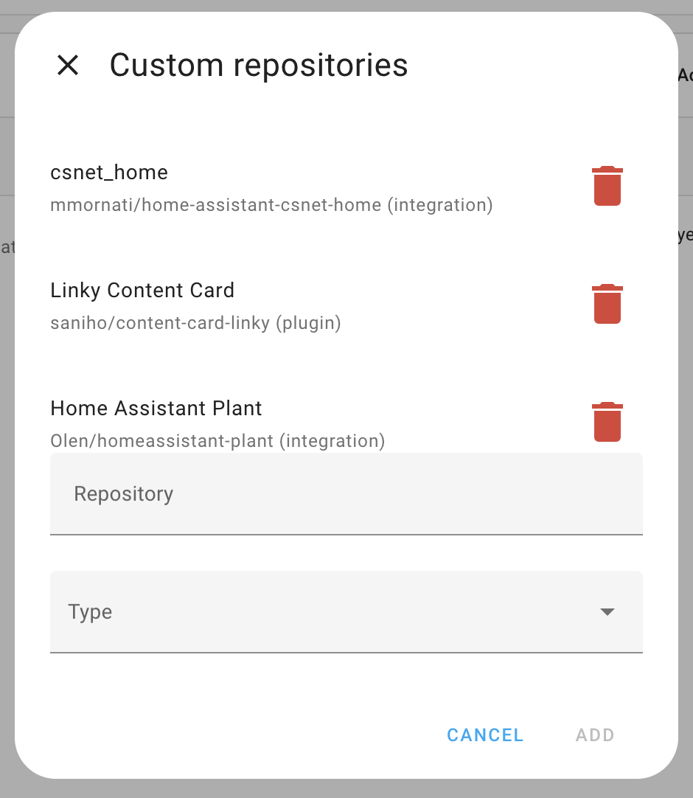
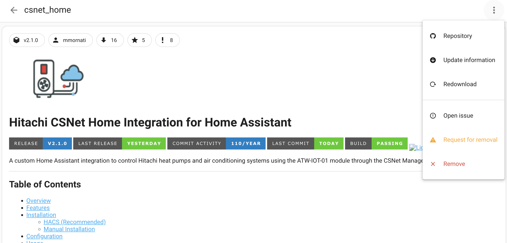
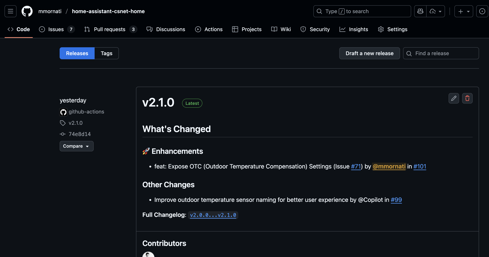
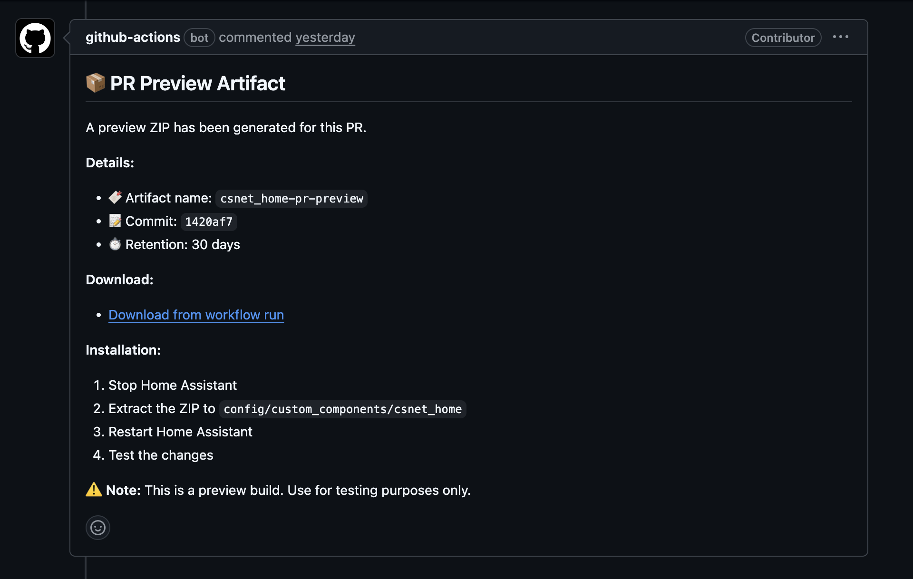
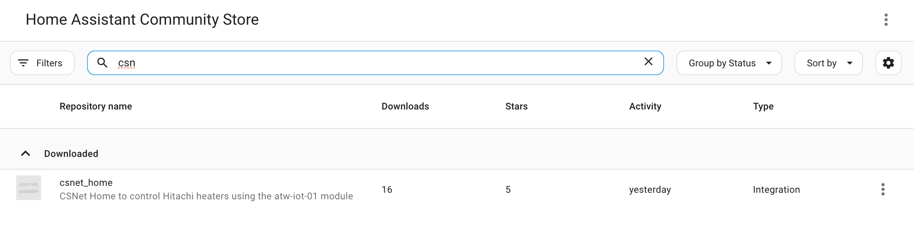

# Installation Guide

This guide will walk you through installing the Hitachi CSNet Home integration for Home Assistant.

## Prerequisites

Before installing, ensure you have:

✅ **Home Assistant** installed and running (version 2023.1.0 or newer recommended)  
✅ **Hitachi heat pump** with ATW-IOT-01 module  
✅ **CSNet Manager account** (same credentials you use for the mobile app or website)  
✅ **Internet connection** from your Home Assistant instance  
✅ **Administrator access** to your Home Assistant installation

---

## Installation Methods

Choose the method that works best for you:

### Method 1: HACS (Recommended) ⭐

HACS (Home Assistant Community Store) makes installation and updates easy.

### Method 2: Manual Installation from Release

Download and install from GitHub releases.

### Method 3: Manual Installation from Source

Install directly from the repository for development or latest features.

---

## Method 1: HACS Installation (Recommended)

### Step 1: Install HACS

If you don't have HACS installed:

1. Visit the [HACS Installation Guide](https://hacs.xyz/docs/setup/download)
2. Follow the instructions to install HACS
3. Restart Home Assistant
4. Configure HACS through the UI

### Step 2: Add Custom Repository (If needed)

> **Note**: If the integration is not yet available in HACS default repositories, you'll need to add it as a custom repository.

1. Open **Home Assistant**
2. Go to **HACS** → **Integrations**
3. Click the **⋮** (three dots) menu in the top right
4. Select **Custom repositories**
5. Add repository URL:
   ```
   https://github.com/mmornati/home-assistant-csnet-home
   ```
6. Select category: **Integration**
7. Click **Add**



### Step 3: Install the Integration

1. In **HACS** → **Integrations**
2. Click the **+ Explore & Download Repositories** button
3. Search for **"CSNet Home"** or **"Hitachi"**
4. Click on **Hitachi CSNet Home**
5. Click **Download**
6. Select the latest version
7. Click **Download** again



### Step 4: Restart Home Assistant

After installation completes:

1. Go to **Settings** → **System**
2. Click **Restart** (top right corner)
3. Confirm the restart
4. Wait for Home Assistant to come back online (usually 1-2 minutes)

✅ **Installation Complete!** Proceed to the [Configuration Guide](Configuration-Guide).

---

## Method 2: Manual Installation from Release

### Step 1: Download the Release

1. Visit the [GitHub Releases page](https://github.com/mmornati/home-assistant-csnet-home/releases)
2. Find the latest release
3. Download the **`hass-custom-csnet-home.zip`** file
4. Save it to your computer



### Step 2: Locate Your Home Assistant Configuration Directory

Your configuration directory is where your `configuration.yaml` file is located.

**Common locations**:
- Home Assistant OS: `/config/`
- Docker: Your mounted config volume
- Core/venv: Usually `~/.homeassistant/`
- Supervised: `/usr/share/hassio/homeassistant/`

You can access it via:
- **File Editor** add-on
- **Samba Share** add-on
- **SSH** access
- **VS Code** add-on

### Step 3: Extract the Integration

Using terminal/command line:

```bash
# Navigate to your Home Assistant config directory
cd YOUR_HASS_CONFIG_DIRECTORY

# Create custom_components directory if it doesn't exist
mkdir -p custom_components

# Navigate into it
cd custom_components

# Create csnet_home directory
mkdir -p csnet_home

# Navigate into it
cd csnet_home

# Extract the downloaded ZIP file
unzip ~/Downloads/hass-custom-csnet-home.zip
```

Or using a file manager:
1. Extract the ZIP file
2. Copy all extracted files to `YOUR_CONFIG/custom_components/csnet_home/`

### Step 4: Verify Installation

Your directory structure should look like this:

```
config/
├── configuration.yaml
└── custom_components/
    └── csnet_home/
        ├── __init__.py
        ├── api.py
        ├── climate.py
        ├── config_flow.py
        ├── const.py
        ├── coordinator.py
        ├── manifest.json
        ├── sensor.py
        ├── water_heater.py
        └── requirements.txt
```

### Step 5: Restart Home Assistant

1. Go to **Settings** → **System**
2. Click **Restart**
3. Wait for restart to complete

✅ **Installation Complete!** Proceed to the [Configuration Guide](Configuration-Guide).

---

## Method 3: Manual Installation from Source

### Step 1: Clone the Repository

Using git:

```bash
cd /tmp
git clone https://github.com/mmornati/home-assistant-csnet-home.git
cd home-assistant-csnet-home
```

Or download as ZIP:
1. Go to [GitHub repository](https://github.com/mmornati/home-assistant-csnet-home)
2. Click **Code** → **Download ZIP**
3. Extract the ZIP file

### Step 2: Copy Integration Files

```bash
# Navigate to your Home Assistant config directory
cd YOUR_HASS_CONFIG_DIRECTORY

# Create custom_components directory
mkdir -p custom_components

# Copy the integration
cp -r /tmp/home-assistant-csnet-home/custom_components/csnet_home custom_components/
```

### Step 3: Restart Home Assistant

1. Go to **Settings** → **System**
2. Click **Restart**
3. Wait for restart to complete

✅ **Installation Complete!** Proceed to the [Configuration Guide](Configuration-Guide).

---

## Installing a Preview Version (Advanced)

You can test unreleased features or bug fixes from Pull Requests.

### Step 1: Find the Preview Build

1. Go to the [Pull Requests](https://github.com/mmornati/home-assistant-csnet-home/pulls) page
2. Open the PR you want to test
3. Look for a bot comment with a workflow run link
4. Click the workflow link to go to GitHub Actions
5. Download the artifact: **`csnet_home-pr-preview`**



### Step 2: Extract and Install

1. **Stop Home Assistant** (important!)
2. Extract the downloaded ZIP file
3. Navigate to `YOUR_CONFIG/custom_components/csnet_home/`
4. **Backup your current installation** (copy the folder elsewhere)
5. Replace all files with the preview version files
6. **Start Home Assistant**

### Step 3: Disable Auto-Updates (If using HACS)

⚠️ **Important**: If you installed via HACS, disable automatic updates to prevent the preview from being overwritten.

1. Go to **HACS** → **Integrations**
2. Find **Hitachi CSNet Home**
3. Disable automatic updates for this integration

### Reverting to Stable

To go back to the stable version:
1. Delete the preview files
2. Restore your backup OR reinstall via HACS
3. Restart Home Assistant

---

## Verifying Installation

After restarting, verify the integration is properly installed:

### Check in Logs

1. Go to **Settings** → **System** → **Logs**
2. Look for any errors related to `csnet_home`
3. You should see no errors at this point

### Check Available Integrations

1. Go to **Settings** → **Devices & Services**
2. Click **+ Add Integration**
3. Search for **"Hitachi"**
4. You should see **"Hitachi CSNet Home"** in the results



If you see the integration in search results, installation was successful! 🎉

---

## Troubleshooting Installation

### Integration Not Showing in Search

**Problem**: Can't find "Hitachi CSNet Home" when adding integration.

**Solutions**:
1. **Clear browser cache**: Press Ctrl+Shift+R (or Cmd+Shift+R on Mac)
2. **Verify file permissions**: Ensure files are readable by Home Assistant
   ```bash
   chmod -R 755 custom_components/csnet_home/
   ```
3. **Check file structure**: Verify `manifest.json` exists in the integration folder
4. **Restart again**: Sometimes requires a second restart
5. **Check logs**: Look for loading errors in Settings → System → Logs

### Python Errors on Startup

**Problem**: Errors about missing modules or syntax errors.

**Solutions**:
1. **Verify Python version**: Home Assistant requires Python 3.11+
2. **Check Home Assistant version**: Update to latest version
3. **Reinstall dependencies**: Delete the integration and reinstall
4. **Check for file corruption**: Re-download and reinstall

### HACS Not Finding Repository

**Problem**: Repository not found when adding custom repository.

**Solutions**:
1. **Check URL**: Ensure you're using the correct URL (no typos)
2. **Check GitHub access**: Ensure you can access GitHub from your network
3. **Wait and retry**: GitHub API rate limits may apply
4. **Check HACS logs**: Go to HACS → Documentation → Logs

### Permission Denied Errors

**Problem**: Can't write files or access directories.

**Solutions**:
1. **Check ownership**: Ensure files are owned by the Home Assistant user
   ```bash
   chown -R homeassistant:homeassistant custom_components/csnet_home/
   ```
2. **Check SELinux/AppArmor**: May need to adjust security policies
3. **Use correct method**: File Editor add-on handles permissions automatically

---

## Post-Installation

Now that installation is complete:

1. **Configure the integration**: Follow the [Configuration Guide](Configuration-Guide)
2. **Explore features**: Check out [Climate Control](Climate-Control), [Water Heater Control](Water-Heater-Control), and [Sensors Reference](Sensors-Reference)
3. **Customize your setup**: Visit [Advanced Features](Advanced-Features)

---

## Updating the Integration

### Via HACS

1. HACS will notify you when updates are available
2. Go to **HACS** → **Integrations**
3. Find **Hitachi CSNet Home**
4. Click **Update**
5. Restart Home Assistant

### Manual Update

1. Download the latest release
2. Stop Home Assistant
3. Backup your current installation
4. Replace files with new version
5. Start Home Assistant

### Checking Your Version

To see your installed version:
1. Go to **Settings** → **Devices & Services**
2. Find **CSNet Home**
3. Click on it
4. Look for version information in device details

Or check `custom_components/csnet_home/manifest.json`:
```json
{
  "version": "2.1.0"
}
```

---

## Uninstalling

If you need to remove the integration:

### Step 1: Remove Configuration

1. Go to **Settings** → **Devices & Services**
2. Find **Hitachi CSNet Home**
3. Click the **⋮** (three dots) menu
4. Select **Delete**
5. Confirm deletion

### Step 2: Remove Files

**Via HACS**:
1. Go to **HACS** → **Integrations**
2. Find **Hitachi CSNet Home**
3. Click **⋮** → **Remove**

**Manually**:
```bash
rm -rf custom_components/csnet_home/
```

### Step 3: Restart Home Assistant

1. Go to **Settings** → **System**
2. Click **Restart**

---

## Next Steps

✅ Installation complete!

Now proceed to:
- **[Configuration Guide](Configuration-Guide)** - Set up the integration
- **[Climate Control](Climate-Control)** - Control your heating and cooling zones
- **[Water Heater Control](Water-Heater-Control)** - Manage your DHW system
- **[Advanced Features](Advanced-Features)** - Explore all available features

---

## Getting Help

If you encounter issues:
- Check [Troubleshooting](Troubleshooting) page
- Search [GitHub Issues](https://github.com/mmornati/home-assistant-csnet-home/issues)
- Ask in [GitHub Discussions](https://github.com/mmornati/home-assistant-csnet-home/discussions)
- Review [FAQ](FAQ) for common questions

---

**[← Back to Home](Home)** | **[Next: Configuration →](Configuration-Guide)**

